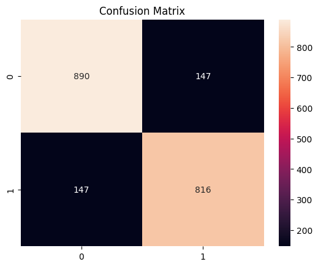

# 🎯 Sentiment Analysis using Machine Learning (NLP)

## 📌 Problem Statement

The objective of this project is to classify text data (reviews) into positive or negative sentiments using Natural Language Processing and machine learning techniques.

---

## 📊 Dataset

* Dataset used: **IMDB Movie Reviews Dataset**
* Contains:

  * Text reviews
  * Sentiment labels (positive / negative)

---

## ⚙️ Approach

### 1. Text Preprocessing

* Converted text to lowercase
* Removed punctuation and special characters
* Removed stopwords
* Tokenization of text

---

### 2. Feature Extraction

* Converted text data into numerical form using:

  * **TF-IDF Vectorization**

This helps in representing text based on word importance.

---

### 3. Model Building

* Used **Support Vector Machine (SVM)** for classification
* Trained the model on processed text data

---

### 4. Model Evaluation

* Evaluated using:

  * Accuracy
  * Precision
  * Recall
  * F1-score

---

## 📈 Results

* Accuracy: **83.8%**

Classification Report:

* Positive Reviews:

  * Precision: 0.83
  * Recall: 0.84

* Negative Reviews:

  * Precision: 0.85
  * Recall: 0.84

Overall model performance is balanced across both classes.

---

## 🔍 Key Insights

* TF-IDF effectively captures important words in text data
* SVM performs well for high-dimensional text classification
* Proper preprocessing significantly improves model performance

---

## 🚀 Future Improvements

* Use deep learning models (LSTM, BERT)
* Perform hyperparameter tuning (GridSearchCV)
* Use larger and more diverse datasets
* Deploy as a web application

---

## 🛠️ Technologies Used

* Python
* Pandas, NumPy
* Scikit-learn
* NLTK

---

## 📌 Conclusion

This project demonstrates how machine learning and NLP techniques can be used to classify text sentiment. It highlights the importance of preprocessing, feature extraction, and model selection in building effective text classification systems.
